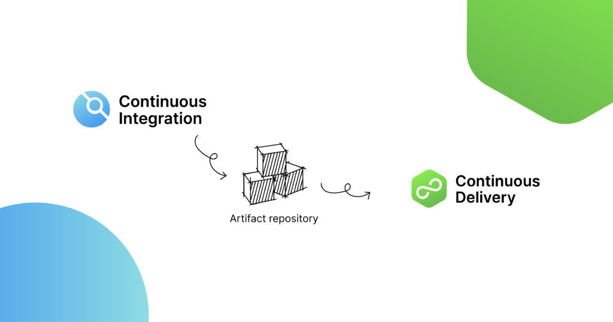

## Continuous Integration

### 1. Was ist Continuous Integration (CI) und wie wird es umgesetzt?
Continuous Integration zählt als Methode zu den Best Practises der DevOps. Sie ermöglicht Entwicklern Codeänderungen häufig in einem zentralen Repository zusammenzuführen, in dem Builds und Tests ausgeführt werden.
Automatisierte Tools werden verwendet, um die Fehlerfreiheit des neuen Codes vor der Integration zu bestätigen.

Ein Versionskontrollsystem für Quellcodes ist der Knackpunkt des CI-Prozesses. Es ermöglicht weitere Checks, wie z. B. automatisierte Tests der Codequalität und Tools für die Syntaxprüfung.

[Quelle](https://www.atlassian.com/de/continuous-delivery/continuous-integration)

### 2. Was sind die Vor- und Nachteile von CI?
Trotz ihrer positiven Merkmale zeigt sich im Arbeitsalltag oft, dass Continuous Integration nicht ausschließlich Vorteile hat. Zwar erspart man sich eine große und langwierige Integrationsphase zum Ende des Projekts und kann Probleme frühzeitig in Angriff nehmen, aber für eingespielte Teams kann eine Umstellung auf Continuous Integration sehr schwierig sein. In einem solchen Fall kann das Verfahren sogar mehr Zeit kosten, anstatt Zeit zu sparen.

| Vorteile  | Nachteile  |
|---|---|
| Frühzeitige Fehlersuche möglich  | Umstellung von gewohnten Prozessen  |
| Ständiges Feedback  | 	Benötigt zusätzliche Server und Umgebungen  |
| Keine Überforderung bei einzelner großer Integration zum Abschluss  | Erarbeitung von geeigneten Test-Abläufen nötig  |
| Genaue Aufzeichnung von Änderungen  | Es kann zu Wartezeiten kommen, wenn mehrere Entwickler annähernd gleichzeitig ihren Code integrieren möchten  |
| Stetige Verfügbarkeit einer funktionierenden, aktuellen Version  |   |
|  Fördert granulares Arbeiten |   |

[Quelle](https://www.ionos.de/digitalguide/websites/web-entwicklung/continuous-integration/#c139582)

### 3. Was ist Continuous Testing und wie wird es umgesetzt?
Unter Continuous Testing versteht man einen Prozess, bei dem automatisiertes Feedback in verschiedenen Phasen des Softwareentwicklungslebenszyklus (Software Development Life Cycle, SDLC) integriert wird, um die Geschwindigkeit und Effizienz bei der Verwaltung von Bereitstellungen zu verbessern.

Continuous Tests nutzen automatisierte Tools, um vordefinierte QA-Scripts in allen Phasen der Produktion zu laden. Diese automatisierten Scripts machen regelmäßige manuelle Eingriffe bei der Durchführung von QA-Tests überflüssig und validieren nacheinander die Effizienz des Quellcodes. Gleichzeitig stellen sie sicher, dass relevantes Feedback sofort an die entsprechenden Teams weitergeleitet wird.

[Quelle](https://www.ibm.com/de-de/topics/continuous-testing)

### 4. Was ist eine Branching Strategie und welches sind die bekannten?
Durch Branching können Entwicklerteams auf einfache Weise innerhalb einer zentralen Codebasis zusammenarbeiten. Erstellt ein Entwickler einen Branch, erstellt das Versionskontrollsystem eine Kopie der Codebasis zu diesem Zeitpunkt. Änderungen am Branch wirken sich nicht auf andere Entwickler im Team aus.

[Quelle](https://www.atlassian.com/de/agile/software-development/branching#:~:text=Durch%20Branching%20k%C3%B6nnen%20Entwicklerteams%20auf,andere%20Entwickler%20im%20Team%20aus.)

Git-Flow und GitHub Flow sind bekannte Branching-Strategien, wobei Git-Flow ein komplexeres Modell für langfristige Projekte mit paralleler Entwicklung und Release-Zweigen bietet, während GitHub Flow eine schlankere, agile Strategie für kontinuierliche Integration und Deployment darstellt.

### 5. Wie kann man Commits und Branches mit User Stories verknüpfen?

Dies kann man mit der Verknüpfung von den verschiedenen Atlassian Produkte erreichen. Die Integration von Jira und Bitbucket ermöglicht eine automatische Verknüpfung von Branches, Commits und Pull Requests mit den entsprechenden User Stories. Wenn diese beiden Tools verbunden sind, können Entwickler direkt aus Jira heraus Branches erstellen. Dies stellt sicher, dass der Branch automatisch mit der jeweiligen User Story assoziiert wird. Außerdem werden Commits, die den Jira-Issue-Key in ihrer Nachricht enthalten, in Jira angezeigt und mit der User Story verlinkt.

[Quelle](https://support.atlassian.com/jira-cloud-administration/docs/integrate-bitbucket-with-jira/)

### 6. Welche Merge Strategien gibt es und wie werden sie umgesetzt?
Es gibt mehrere Merge-Strategien in Git, die je nach Anwendungsfall genutzt werden können:

#### Recursive (Standardstrategie):
Diese Strategie wird standardmäßig verwendet und ist darauf ausgelegt, zwei Branches mithilfe eines dreiseitigen Merge-Algorithmus zusammenzuführen. Sie berücksichtigt gemeinsame Vorfahren der Branches und erstellt bei Bedarf einen virtuellen gemeinsamen Vorfahren. Diese Strategie ist flexibel und deckt die meisten Fälle ab.

#### Resolve: 
Diese Strategie eignet sich für einfache Merges zwischen zwei Branches. Sie verwendet ebenfalls den dreiseitigen Merge-Algorithmus, ist jedoch eingeschränkter und vor allem für Szenarien mit wenigen Konflikten gedacht.

#### Octopus: 
Diese Strategie ermöglicht das Zusammenführen von mehr als zwei Branches in einem Schritt. Sie ist besonders nützlich, wenn mehrere Feature-Branches kombiniert werden sollen, jedoch nur dann anwendbar, wenn keine manuellen Konfliktlösungen erforderlich sind.

#### Ours: 
Mit dieser Strategie wird der Stand des aktuellen Branches vollständig beibehalten, während die Änderungen des anderen Branches ignoriert werden. Sie eignet sich, um die Historie eines Branches zu bewahren, während die Integration anderer Branches nicht notwendig ist.

#### Subtree: 
Diese Strategie wird verwendet, um Branches als Unterverzeichnis in ein anderes Repository zu integrieren. Sie passt die Struktur des zu mergeenden Branches an die Zielstruktur an und ist besonders nützlich bei der Arbeit mit Subprojekten oder Monorepos.

Die Wahl der Merge-Strategie hängt von der spezifischen Situation und den Anforderungen des Projekts ab. Recursive ist die gebräuchlichste und flexibelste Methode, während die anderen Strategien für spezifische Anforderungen oder Sonderfälle verwendet werden.

[Quelle](https://git-scm.com/docs/merge-strategies)

### 7. Was ist Semantic Versioning und wie wird es umgesetzt?
Semantic Versioning (SemVer) ist ein System zur Vergabe von Versionsnummern in der Softwareentwicklung, das klare Informationen über den Umfang und die Art von Änderungen zwischen verschiedenen Versionen liefert. Es folgt dem Format MAJOR.MINOR.PATCH, wobei jede Komponente eine spezifische Bedeutung hat:

* MAJOR: Wird erhöht, wenn inkompatible API-Änderungen vorgenommen werden.
* MINOR: Wird erhöht, wenn neue, abwärtskompatible Funktionen hinzugefügt werden.
* PATCH: Wird erhöht, wenn abwärtskompatible Fehlerbehebungen durchgeführt werden.

Zusätzlich können Vorabversionen und Build-Metadaten durch Anhängen von Präfixen wie -alpha, -beta oder +build gekennzeichnet werden. Dieses System ermöglicht es Entwicklern und Nutzern, die Auswirkungen von Updates besser einzuschätzen und die Kompatibilität zwischen verschiedenen Softwareversionen sicherzustellen.

[Quelle](https://semver.org/)

### 8. Welchen Unterschied haben Mono- und Multirepo (speziell im Zusammenhang mit Microservices)?
Im Kontext von Microservices unterscheiden sich Monorepos und Multirepos hauptsächlich in der Verwaltung des Quellcodes:

* Monorepo: Alle Microservices werden in einem einzigen Repository gespeichert. Dies erleichtert die gemeinsame Nutzung von Code und die Koordination von Änderungen über verschiedene Services hinweg. Allerdings kann die Verwaltung eines großen Monorepos komplex sein und spezielle Tools erfordern. 
DEV.TO

* Multirepo: Jeder Microservice hat sein eigenes Repository. Dies fördert die Unabhängigkeit der Teams und ermöglicht separate Entwicklungs- und Deployment-Zyklen. Allerdings kann die Verwaltung von Abhängigkeiten und die Koordination von Änderungen über mehrere Repositories hinweg herausfordernd sein. 
DEV.TO

Die Wahl zwischen Mono- und Multirepo hängt von Faktoren wie Teamgröße, Projektkomplexität und spezifischen Anforderungen ab.

[Quelle](https://dev.to/sumisastri/what-is-the-difference-between-monoliths-microservices-monorepos-and-multirepos-111c#what-is-the-difference-between-monorepos-and-multirepos)

### 9. Was ist eine Artifact-Repository und welche Rolle spielt es in Ihrem Prozess?
Ein Artifact-Repository ist ein zentrales Speichersystem für Artefakte wie Binärdateien, Bibliotheken oder Container-Images, die während des Entwicklungsprozesses entstehen. Es ermöglicht die zentrale Verwaltung, Versionierung und Bereitstellung dieser Dateien, was besonders in CI/CD-Pipelines entscheidend ist. Dadurch werden Konsistenz und Nachverfolgbarkeit gewährleistet, und der Entwicklungs- und Release-Prozess wird effizienter.

[Quelle](https://www.harness.io/blog/what-is-artifact-repository)